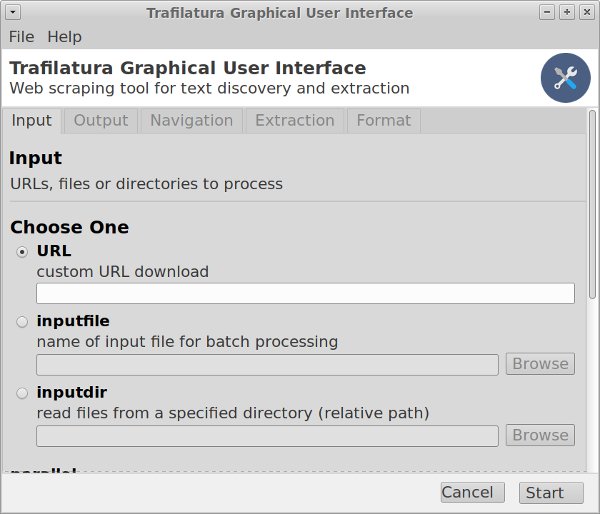

trafilatura_gui: Web scraping tool for text discovery and retrieval
===================================================================

Graphical User Interface (GUI) for `trafilatura <https://github.com/adbar/trafilatura>`_. This tool for text discovery and retrieval seamlessly downloads, parses, and scrapes web page data: it can extract metadata, main body text and comments while preserving parts of the text formatting and page structure. The output can be converted to different formats (TXT, CSV, JSON, XML and XML-TEI).

This is especially useful in cases where the other usage options don’t appear to be convenient. This type of interface allows for interact with trafilatura through graphical icons and menus instead of text-based user interfaces, typed command labels or text navigation.

Work in progress!

Installation
------------

1. Open a terminal window:
    - `Open the command-line interface <https://tutorial.djangogirls.org/en/intro_to_command_line/#open-the-command-line-interface>`_
2. Install Python:
    - Enter ``python3 --version`` (or if doesn't work ``python --version``) in the terminal window to see if it's already installed (the answer should read ``Python 3.X.X`` where X is a number)
    - `Python installation <https://tutorial.djangogirls.org/en/python_installation/#python-installation>`_
3. Install the necessary software versions straight from the repositories by copying the following instructions into the terminal window (use ``pip3`` or ``pip`` otherwise):
    - ``pip3 install -U git+https://github.com/adbar/trafilatura.git``
    - ``pip3 install -U git+https://github.com/adbar/trafilatura_gui.git``

All instructions for the terminal window are followed by pressing the `enter key <https://en.wikipedia.org/wiki/Enter_key>`_.

Allow some time for the installation to run. If you run into problems please contact me (see below).

Getting started
---------------

Just type ``trafilatura_gui`` in a terminal window and press the `enter key <https://en.wikipedia.org/wiki/Enter_key>`_.

Reporting issues
----------------

Feel free to `contact me <https://adrien.barbaresi.eu/>`_ and to file issues on the `dedicated page <https://github.com/adbar/trafilatura_gui/issues>`_.

Troubleshooting
---------------

Installation and terminal
~~~~~~~~~~~~~~~~~~~~~~~~~

- `Introduction to the command-line <https://melaniewalsh.github.io/Intro-Cultural-Analytics/Command-Line/The-Command-Line.html>`_
    - `How to Open a Terminal Window in Mac <https://www.wikihow.com/Open-a-Terminal-Window-in-Mac>`_
    - `How to Open Terminal in Windows <https://www.wikihow.com/Open-Terminal-in-Windows>`_
    - `How to Start Using the Linux Terminal <https://www.howtogeek.com/140679/beginner-geek-how-to-start-using-the-linux-terminal/>`_
- `Installation instructions <https://trafilatura.readthedocs.io/en/latest/installation.html>`_ for *trafilatura*

Mac OS X
~~~~~~~~

- ``This program needs access to the screen...`` This problem is related to the way you installed Python or the shell you're running:
    1. Clone the reposoitory and start with "pythonw trafilatura_gui/interface.py" (`source <https://docs.python.org/3/using/mac.html#running-scripts-with-a-gui>`_)
    2. `Configure your virtual environment <https://wiki.wxpython.org/wxPythonVirtualenvOnMac>`_ (Python3 and wxpython 4.1.0)

Linux (Debian/Ubuntu)
~~~~~~~~~~~~~~~~~~~~~

- ``sudo apt install libgtk-3-dev``
- optional: to save compilation time, use a wxpython wheel from https://extras.wxpython.org/wxPython4/extras/linux/gtk3/ (according to Linux distribution, ``wxpython`` version 4.1.0)

Screenshot
----------

